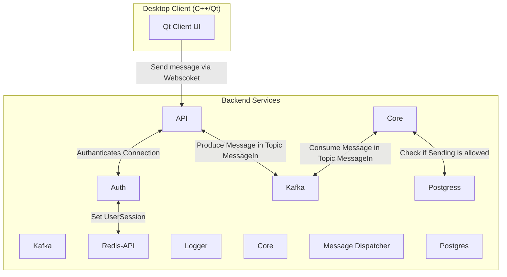

# Messages

```mermaid
  graph TD
    subgraph Client["Desktop Client (C++/Qt)"]
        UI[Qt Client UI]
    end
    
    UI --> |Send message via Webscoket|API[API]
    
    subgraph Backend["Backend Services"]
        API[API]
        KAFKA[Kafka]
        REDIS-API[Redis-API]
        LOGGER[Logger]
        CORE[Core]
        AUTH[Auth]
        MD[Message Dispatcher]
        POSTGRES[Postgres]

        API <--> |Authanticates Connection| AUTH
        AUTH <--> |Set UserSession| REDIS-API
        API <--> |Produce Message in Topic MessageIn| Kafka

        Core <--> |Consume Message in Topic MessageIn| Kafka
        Core <--> |Check if Sending is allowed| Postgress
        
    end
```
