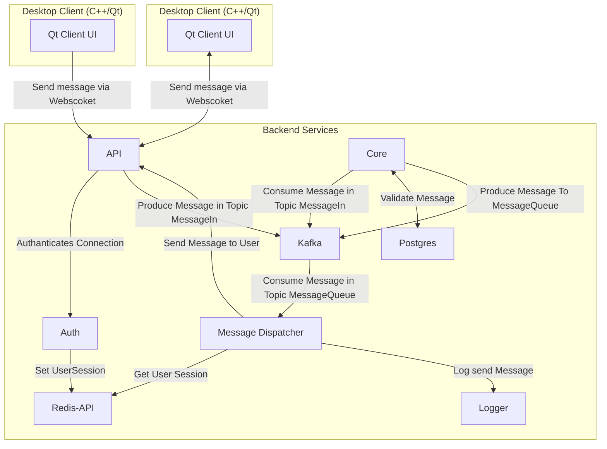

# Messages

```mermaid
  graph TD
    subgraph Client-1["Desktop Client (C++/Qt)"]
        UI1[Qt Client UI]
    end

    subgraph Client-2["Desktop Client (C++/Qt)"]
        UI2[Qt Client UI]
    end
    
    UI1 --> |Send message via Webscoket|API[API]
    UI2 <--> |Send message via Webscoket|API[API]
    
    subgraph Backend["Backend Services"]
        API[API]
        KAFKA[Kafka]
        REDIS-API[Redis-API]
        LOGGER[Logger]
        CORE[Core]
        AUTH[Auth]
        MD[Message Dispatcher]
        POSTGRES[Postgres]

        API --> |Authanticates Connection| AUTH
        AUTH --> |Set UserSession| REDIS-API
        API --> |Produce Message in Topic MessageIn| KAFKA

        CORE --> |Consume Message in Topic MessageIn| KAFKA
        CORE <--> |Validate Message| POSTGRES
        CORE --> |Produce Message To MessageQueue| KAFKA

        KAFKA --> |Consume Message in Topic MessageQueue| MD
        MD --> |Get User Session| REDIS-API
        MD --> |Log send Message| LOGGER
        MD --> |Send Message to User| API
        
    end
```
