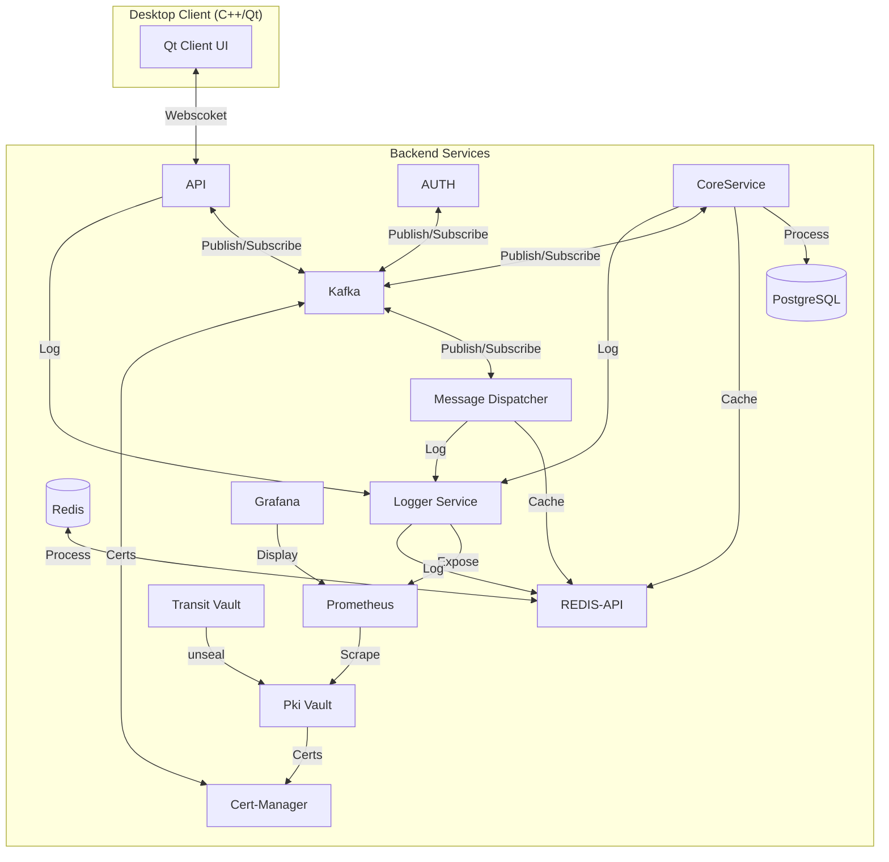

# 🔐 Ventra-Messenger - Secure & Scalable Self-Hosted Messenger (still in development)

[](https://opensource.org/licenses/MIT)


A high-performance messenger with end-to-end encryption, scalable cloud architecture, and full self-hosting capability.



## 🌟 Key Features
- **Military-Grade Encryption**: Double Ratchet + OpenSSL for E2E encryption with Forward Secrecy
- **High-Performance Backend**: Parallelized Go services with Kafka
- **Native Desktop Client**: Resource-efficient Qt/C++ app with local SQLite database
- **Enterprise Scalability**: Horizontal scaling with Redis and Kafka

# 🧱 Technology Stack
### Component	Technologies
- **Backend**:	Go, Docker
- **Frontend**:	C++17, Qt 6, SQLite3 + SQLCipher
- **Realtime**:	WebSockets, Kafka, Redis Pub/Sub
- **Data Storage**:	PostgreSQL, Redis, SQLite
- **Security**:	OpenSSL, Double Ratchet (AES-256-GCM + X25519 + HKDF), JWT, Ed25519,
- **Infrastructure**:	Docker Compose, Kubernetes

# 🚀 Local Installation
### Backend
```bash
not ready
``` 

#### Access Points:
- not ready

### Client:
```bash
not ready
```
