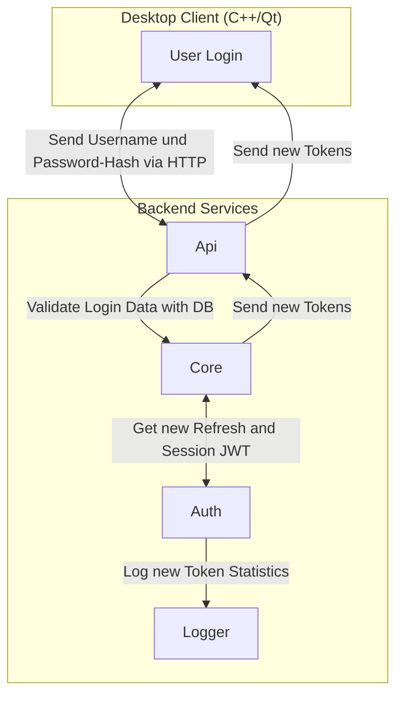

# UserAuth

# SeviceAUTH
- Beim start des Backend machten die AUTH Services eine anfrage an den HashiVault um zu gucken ob es schon ein Root CA gibt, wenn ja holen sie sich es und melden isch beim core service der trägt sie dann als Auth service ein, wenn nicht melden sie sich auch beim core service der gibt dann den befehel an den Ersten sich meldenden ein Root CA zu erstellen das root ca wird dann im Vault gesecihert und die andern AUTH instanzen bekommen eine anfrage sich neu zustarten und das CA auf zunehmen.
- Nun werden vom Head AUTH service für alle eingetragende Services zertifikate erstellt so das alles auf mTLS umsteigen kann also für alle API, Message Dispatcher, Kafka, Core, Logger, Auth und Redis-API instanzen
